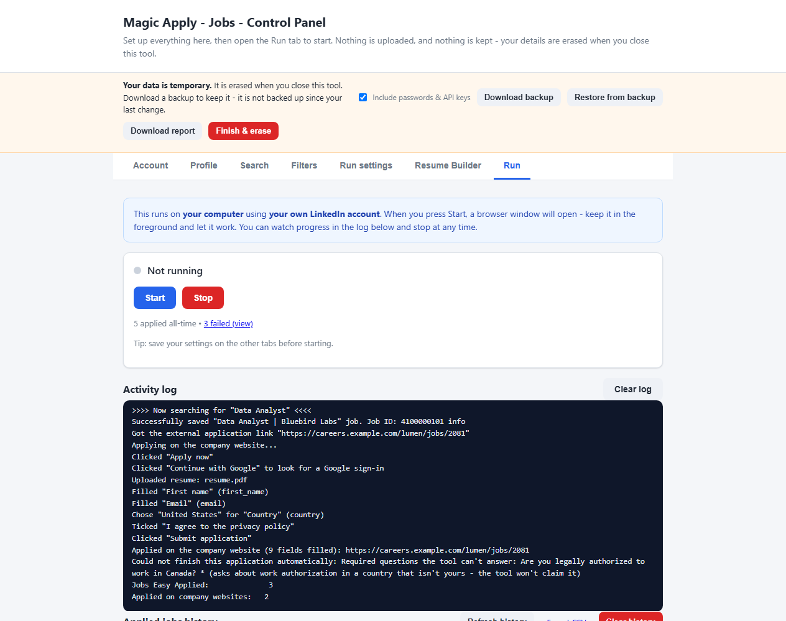
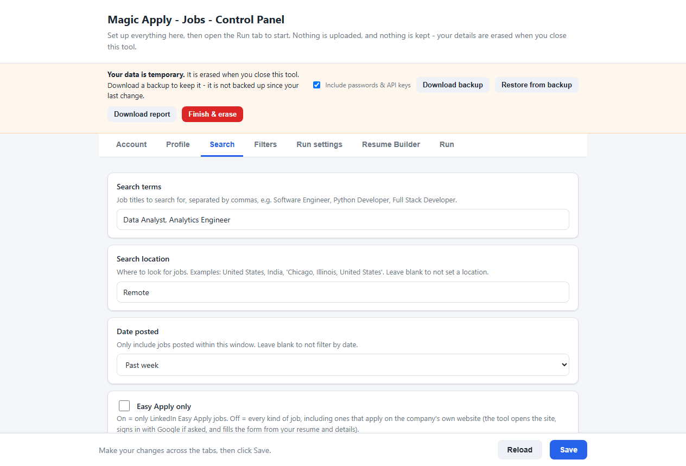
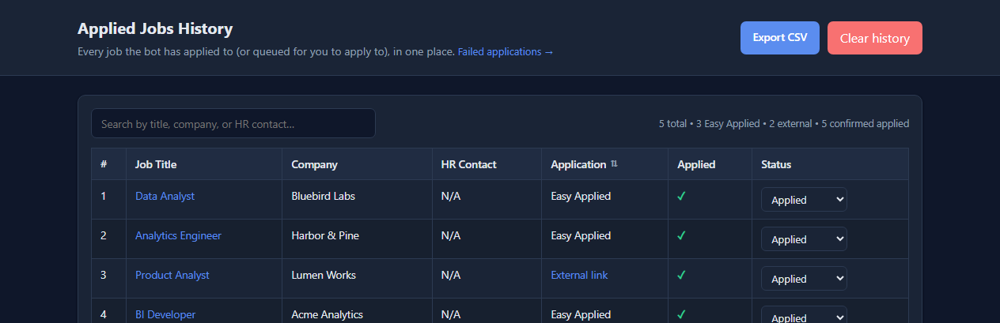
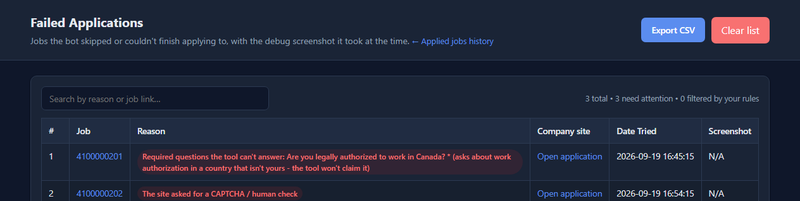

<div align="center">

# Magic Apply - Jobs

**A free, open-source job application assistant.**<br>
It applies on LinkedIn *and* on the company's own career site, from your own computer.

[](LICENSE)
[](https://github.com/sideeffects69/Magic-Apply-Jobs/releases)
[](https://sideeffects69.github.io/Magic-Apply-Jobs/)

[Website](https://sideeffects69.github.io/Magic-Apply-Jobs/) &nbsp;·&nbsp; [Download](https://github.com/sideeffects69/Magic-Apply-Jobs/releases) &nbsp;·&nbsp; [How it works](#how-it-works) &nbsp;·&nbsp; [Get started](#get-started) &nbsp;·&nbsp; [Report an issue](https://github.com/sideeffects69/Magic-Apply-Jobs/issues)



</div>

---

Magic Apply - Jobs finds roles that match your search, applies with **LinkedIn Easy Apply**, and for every other job **opens the company's own application page, signs in with Google when the site asks, and fills in the form from your details**. It can also answer the odd question with AI. It runs entirely on your own computer, using your own LinkedIn account, and it forgets everything when you close it.

**Free and open source under the [MIT License](LICENSE), and it will stay that way.**

> **Beta.** The company-website applier has been tested against realistic local mock sites, not yet against many real employers. Keep *Pause before submit* on and watch your first few runs. See [honest limits](#applying-on-company-websites).

## Contents

- [Why use it](#why-use-it)
- [How it works](#how-it-works)
- [Get started](#get-started)
- [Applying on company websites](#applying-on-company-websites)
- [Your data: nothing is kept](#your-data-nothing-is-kept)
- [Screenshots](#screenshots)
- [FAQ](#faq)
- [Manual install and configuration](#manual-install-and-configuration)
- [Contributing](#contributing)
- [Disclaimer and terms of use](#disclaimer-and-terms-of-use)
- [License](#license)

## Why use it

- **It does not stop at Easy Apply.** Most jobs on LinkedIn send you to the employer's own site, and that is where most auto-apply tools give up. This one follows the link and applies there too.
- **Careful, not reckless.** It never submits with a required question empty, never invents an answer, never overwrites a field that is already filled in, and hands CAPTCHAs and 2-step verification to you.
- **Private by design.** Nothing is kept between sessions. Your settings, login and history are erased when you close the tool; a backup file is the only way to keep them.
- **No code to edit.** You set everything up in your web browser and run it with a button.
- **Free.** No account, no subscription, no paid tier.

## How it works

1. **Fill in your profile** in the control panel that opens in your browser (or restore the backup file you saved last time).
2. **Click Start.** A Chrome window opens on your computer and the tool searches LinkedIn with your own account.
3. **It applies for you.** Easy Apply jobs are applied for directly. For other jobs it opens the company's page, signs in with Google if the site asks, uploads your resume and fills in the form.
4. **Finish what it couldn't.** Anything it could not complete goes to the **Failed jobs** list with the reason, a link and a screenshot. When you are done, download a backup and click **Finish & erase**.

## Get started

### Windows: one portable file

**Download `MagicApply.exe` from the [Releases page](https://github.com/sideeffects69/Magic-Apply-Jobs/releases)** and double-click it. The control panel opens in your browser. There is no installer and no Python needed; it only needs **Google Chrome**.

Compare the file's SHA-256 with the one in the release notes (`certutil -hashfile MagicApply.exe SHA256`). The exe is not code-signed, so Windows SmartScreen may say "Windows protected your PC" the first time: click *More info*, then *Run anyway*. Because it can drive a browser it is sometimes flagged by antivirus programs; if yours complains, build it yourself with `build_exe.bat` so you know exactly what is inside. `MagicApply.exe --selftest` checks that everything the exe needs is bundled.

### Any system: the launcher

New here, or not comfortable editing code? Use the built-in control panel.

1. **Download this project** (green "Code" button, then "Download ZIP", and unzip it; or clone it).
2. **Double-click the launcher for your system:**
    - **Windows:** `start.bat`
    - **macOS:** `start.command`
    - **Linux:** `start.sh` (run `./start.sh` in a terminal)

    **On Windows, `start.bat` checks your computer and installs anything that is missing (Python 3.12, Google Chrome and all the tool's packages), so there is nothing to install by hand.** The first run can take a few minutes; after that it starts in seconds. On macOS and Linux, install [Python 3.10+](https://www.python.org/downloads/) and [Google Chrome](https://www.google.com/chrome) first; the launcher does the rest. The macOS and Linux launchers are included but less tested than the Windows ones.
3. Your browser opens the **control panel** automatically (the exact address, for example `http://127.0.0.1:5000`, is shown in the launcher window; if port 5000 is used by another program, such as macOS AirPlay, the next free port is used automatically). If you saved a backup file last time, click **Restore from backup** and everything fills back in. Otherwise fill in the tabs (**Account, Profile, Search, Filters, Run settings**) and click **Save**.
4. Go to the **Run** tab and click **Start**. It shows what it is about to search for, and if you changed a setting without saving it, offers to save it first (the bot only uses *saved* settings). A Chrome window then opens and begins applying; keep it in the foreground. You can watch progress in the log and click **Stop** at any time.
5. When you are done, click **Download backup** (if you want to keep your details), then **Finish & erase**.

> **Before your first run:** open the **Profile** tab and set your own details. *Years of experience*, *desired salary*, *current salary* and *notice period* start out as "not set" (blank, `0`, `0` and `-1`), and the tool never types a number you didn't give it. A form that asks for one of them is then left for you (or for the AI, if you turned it on), so fill them in if you want those applications to go through on their own. A notice period of `0` means "I can start immediately".

The control panel is reachable only from your own computer, and it refuses requests coming from other websites.

### Developers: from source

```bash
git clone https://github.com/sideeffects69/Magic-Apply-Jobs.git
cd Magic-Apply-Jobs
pip install -r requirements.txt
python app.py
```

`app.py` opens the control panel and prints its address. See [manual install and configuration](#manual-install-and-configuration) for the details.

## Applying on company websites

Most jobs on LinkedIn are not Easy Apply: they send you to the employer's own site. In **Search**, turn **Easy Apply only** off (it is off by default) and the tool handles those too:

1. **Opens the company's application page** from the LinkedIn job.
2. **Signs in with Google if the site asks.** It looks for a "Sign in / Sign up / Continue with Google" button (on the page, in a pop-up, or inside Google's own frame), clicks it, and picks your Google account (set it in **Account, Google account for company sites**). If your browser is already signed in to Google this is automatic.
3. **Uploads your resume first**, so the site's own resume autofill runs.
4. **Fills only what is still empty.** A field the site already filled, or that you typed, is never replaced, not by the tool and not by your profile.
5. **Clicks Next / Continue / Submit** page after page and stops when the site confirms the application.

It is deliberately cautious:

- **It never submits with a required question empty**, and it **never invents an answer**. A question it can't answer from your profile goes to the AI (if you turned that on); otherwise it waits for you in the browser window (**Run settings, Wait for me on hard steps**), and if you don't answer in time the job is saved to the **Failed jobs** list with the reason and a screenshot, never submitted half-empty.
- **It never types a Google password, and never gets past a CAPTCHA or 2-step verification.** Those are left to you: the tool waits, you finish that screen in the browser, and it carries on.
- Marketing opt-ins ("send me the newsletter") are left unticked; privacy and terms consent boxes are ticked.
- Your name, email and phone must be set first (Profile tab). The template placeholders (`First`, `123 Main Street`, and so on) are never sent to an employer.
- It only says you are authorized to work in **your own** country. A question about another country (for example the US, when you live in India) is left for you. It also doesn't assume you will relocate.
- Number questions are answered by range: 3 years goes in "3-5 years", never in "10-13 years".
- If Google's screen asks for more than a sign-in (Drive, Gmail, "see, edit, delete"), it stops and lets you decide; it never picks a Google account by guessing.
- If LinkedIn's daily Easy Apply cap is reached, the tool carries on with company-site jobs instead of stopping.

**Honest limits.** Career sites are all different. The tool works on ordinary forms (including forms inside iframes, styled radio buttons and multi-page flows), but some will always need you: sites that force an email-and-password account with no Google option, heavily custom dropdowns, CAPTCHAs, and file-upload-only steps. Those end up in the Failed jobs list with the company's link so you can finish them by hand. It has been tested against realistic local mock sites, not against every employer on the internet, so watch the first few runs.

## Your data: nothing is kept

**This tool does not remember anything between sessions.** Everything you enter (settings, LinkedIn login, resume text, uploaded resumes, applied-jobs history) exists only while the control panel is open, and is **erased when you close it**. Whoever opens the tool next starts completely fresh.

To keep your details, use the bar at the top of the control panel:

- **Download backup** saves everything into one file (`AutoJobApplier-backup-<date>.json`). Untick *Include passwords & API keys* if you would rather retype them next time; the file is then free of secrets. A backup with passwords in it is as sensitive as the passwords themselves, so keep it somewhere private.
- **Restore from backup** loads that file next time and every field fills back in: settings, resume text, resume files and applied-jobs history (which also keeps the daily application cap accurate).
- **Finish & erase** offers a backup, then erases everything and closes the tool. Closing the launcher window, pressing Ctrl+C or logging off does the same erase, so if you don't save a backup, your data is gone.

What a backup contains: settings, resume text, uploaded and generated resume files, applied-jobs history. It does not contain the failed-jobs list, logs, screenshots or the browser profile.

**Something went wrong? Send a report.** Because the log and the failed-jobs list are erased with everything else, click **Download report** *before* you close the tool (the Finish & erase window offers it too). It saves a plain-text file (`MagicApply-report-<date>.txt`) with the last part of the activity log, why jobs failed, and which settings were on. Your name, email, phone, address, passwords, API keys, links to you and folder names are masked, and it leaves out your applied-jobs list and screenshots. The masking is automatic and can miss things, so **read the file before you share it**, then attach it to an [issue](https://github.com/sideeffects69/Magic-Apply-Jobs/issues).

**Where it lives while the tool is open:** in a private per-user folder, never inside the project folder, so you can zip, copy or share the project without any of your data going along:

| System | Folder |
|--------|--------|
| Windows | `%LOCALAPPDATA%\AutoJobApplier` |
| macOS | `~/Library/Application Support/AutoJobApplier` |
| Linux | `~/.config/AutoJobApplier` |

A relative resume path such as `all resumes/default/resume.pdf` is looked up inside that folder; you can also give a full path to a file anywhere on your computer. The tool's own Chrome guest profile (safe mode) lives there too and is erased with the rest. If you are *not* in safe mode, the tool uses your normal Chrome profile, and your LinkedIn login stays in Chrome itself; the tool never erases that.

**For developers:** set the environment variable `AUTOJOBAPPLIER_KEEP_DATA=1` before starting the tool to switch the erase off while you work on it. The panel shows a "Keep-data mode is on" notice when it is active. If the tool crashes, leftover data can remain until you next open the panel; use **Finish & erase** to clear it.

## Screenshots

These are real screenshots of the control panel. The person, companies and jobs shown are made up.

| Choose what to search for | Everything it applied for |
|---|---|
|  |  |

**Jobs it could not finish, with the reason and a link so you can complete them yourself:**



## FAQ

**Is it really free?** Yes. It is free and open source under the MIT License, with no account, subscription or paid tier.

**Will it work on any company website?** It handles ordinary application forms, including multi-page flows and forms inside iframes. Some sites will always need you (forced email-and-password accounts, CAPTCHAs, very custom questions), and anything it can't finish is saved to the Failed jobs list. Treat it as a beta.

**Is it safe for my LinkedIn account?** LinkedIn has rules about automated activity and may limit or restrict accounts that break them. You use the tool at your own risk. Keep the daily cap low and watch your first runs.

**Does it store or upload my data?** No. It runs on your computer and erases your details when you close it. If you turn on the optional AI answers, the question, the job description and your "about me" text are sent to the AI provider you choose.

The [website](https://sideeffects69.github.io/Magic-Apply-Jobs/) has the full [FAQ](https://sideeffects69.github.io/Magic-Apply-Jobs/faq/) and longer guides:

- [How to auto apply on LinkedIn, step by step](https://sideeffects69.github.io/Magic-Apply-Jobs/how-to-auto-apply-on-linkedin/)
- [LinkedIn Easy Apply limit: how many per day?](https://sideeffects69.github.io/Magic-Apply-Jobs/linkedin-easy-apply-limit/)
- [Is LinkedIn auto apply safe? The risks, plainly](https://sideeffects69.github.io/Magic-Apply-Jobs/is-linkedin-auto-apply-safe/)
- [Auto apply on company career sites: how it works](https://sideeffects69.github.io/Magic-Apply-Jobs/apply-on-company-websites/)
- [Free LinkedIn auto apply tools: open source vs extensions](https://sideeffects69.github.io/Magic-Apply-Jobs/free-linkedin-auto-apply-tools/)

## Manual install and configuration

Only needed if you don't use the launchers above.

1. Install [Python 3.10](https://www.python.org/downloads/) or above and make sure it is added to PATH.
2. Install [Google Chrome](https://www.google.com/chrome).
3. In a terminal, in the project folder, install the packages:
    ```bash
    pip install -r requirements.txt
    ```
4. Chrome Driver is downloaded automatically (`auto_manage_driver = True` in `config/settings.py`). If you turn that off, download the [Chrome Driver](https://googlechromelabs.github.io/chrome-for-testing/) matching your Chrome version and place it where Chrome is installed, or run `windows-setup.bat` from the `/setup` folder on Windows.

Prefer editing files to using the control panel? The `/config` folder holds the defaults:

1. `personals.py`: your name, phone number, address, and so on.
2. `questions.py`: your answers for application questions, and whether the bot should pause before submitting or when it can't answer a question.
3. `search.py`: search terms, job filters, and rules for which jobs to apply for or skip.
4. `secrets.py`: your LinkedIn username and password and an optional AI API key. Leave the username and password blank to use the browser's saved login, or log in by hand when asked.
5. `settings.py`: keep screen awake, click interval, run in background, automatic Chrome-driver management, and the daily application cap.

Then run `runAiBot.py`. To open the control panel instead (settings, run controls, applied-jobs history), run `app.py`; it prints the address to open.

> The `/config/*.py` files are generic templates. Anything you save in the control panel lives only for that session (see above) and overrides them, so **never put real personal details in these files** if you plan to share the project.

**Resume Builder (optional):** don't have an ATS-friendly resume? Open the control panel's **Resume Builder** tab, fill in your experience, education and skills as YAML, and click **Generate ATS Resume** to get a clean, single-column PDF (built with the open-source [RenderCV](https://github.com/rendercv/rendercv)). It needs `pip install -r requirements-resume.txt` (Python 3.12+); `start.bat` installs it for you when it can. The Resume Builder is not included in the portable exe.

## Contributing

Bug reports, ideas and pull requests are welcome. Please read [CONTRIBUTING.md](CONTRIBUTING.md) first: run the tests, keep changes small and tested, and never commit personal data. To report a problem, use **Download report** in the control panel and attach the file to an [issue](https://github.com/sideeffects69/Magic-Apply-Jobs/issues).

## Disclaimer and terms of use

**This tool runs on your own computer and acts through your own accounts. It is provided free and open source, with no warranty of any kind. You are responsible for how you use it, including making sure your use complies with the terms of any website or service you use it with. The authors and contributors accept no liability for how it is used.**

Please consider the following:

- **LinkedIn policies:** LinkedIn has policies regarding automated activity on its platform. It is your responsibility to review and comply with them before using this tool with your account.
- **No warranties or guarantees:** This program is provided as is, without any warranties or guarantees of any kind. The accuracy, reliability and effectiveness of the program cannot be guaranteed. Use it at your own risk.
- **Disclaimer of liability:** The creators and contributors of this program shall not be held responsible or liable for any damages or consequences arising from the direct or indirect use, interaction, or actions performed with this program. This includes but is not limited to any legal issues, loss of data, or other damages incurred.
- **Use at your own risk:** Take care that your usage, interactions and actions with this program comply with applicable laws, regulations and the terms of the services you use it with.
- **Chrome Driver:** This program uses the Chrome Driver to control your browser. Please review and comply with the terms and conditions specified for [Chrome Driver](https://chromedriver.chromium.org/home).
- **Trademarks:** This is an independent open-source project. It is not affiliated with, endorsed by or sponsored by LinkedIn or Google; those names belong to their owners.

## License

Free and open source under the **MIT License** (see [`LICENSE`](LICENSE)). You are free to use, copy, modify, and distribute it, including in commercial and closed-source work, as long as the copyright notice and permission notice are preserved. It is provided "as is", without warranty of any kind.

Parts of this project build on earlier MIT-licensed work; that work's copyright notice is preserved in the [`LICENSE`](LICENSE) file, as the MIT License requires.
